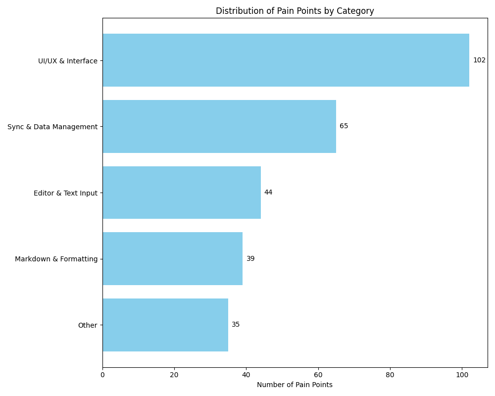

## Executive Summary
- Analyzed 754 user feedback items from Reddit, GitHub, and forums to identify product priorities
- Built an AI-powered analysis pipeline to categorize 511 pain points and 243 feature requests
- Discovered two critical issues threatening user retention: unreliable sync causing data loss and frustrating UI blocking adoption
- Created actionable roadmap with clear metrics, reducing complex user feedback into strategic priorities

## Project Overview

As a product engineer, I wanted to demonstrate how technical skills and product thinking combine to solve real user problems. I chose Joplin, an open-source note-taking app, because I'm interested in how we use tools to organize knowledges and because Joplin has an active community generating feedback across multiple channels.

**The Challenge:** Transform unstructured user feedback into actionable product strategy.

**My Approach:**
1. **Data Collection:** Scraped 754 feedback items from Reddit, GitHub Issues, and Discourse forums
2. **AI Analysis:** Built a Python pipeline using LLMs to categorize and analyze feedback
3. **Synthesis:** Combined quantitative metrics with qualitative insights
4. **Strategy:** Developed prioritized roadmap based on impact and frequency

[View the code on GitHub →](https://github.com/HanifCarroll/joplin-ux-analysis)

## Technical Implementation

I built an automated analysis pipeline that could handle unstructured feedback at scale:

```python
# Sample from the analysis pipeline modified to show key concepts

class FeedbackCategorizer:
    def __init__(self):
        self.client = OpenAI(api_key=os.getenv("OPENAI_API_KEY"))
        self.model = "o4-mini"
        
    def process_feedback(self, threads):
        """Extract and categorize user feedback automatically"""
        
        # Extract pain points from raw user comments
        pain_points = [point for thread in threads 
                      for point in thread.get("pain_points", [])]
        
        # AI-powered batch categorization
        for i in range(0, len(pain_points), 25):
            batch = pain_points[i:i + 25]
            
            response = self.client.chat.completions.create(
                model=self.model,
                messages=[{"role": "user", "content": self.create_prompt(batch)}]
            )
            
            # Parse and save categorized results
            results = json.loads(response.choices[0].message.content)
            self.save_results(results)
```

**Key Technical Decisions:**
- Created multi-platform data collection system with rate limiting and incremental state management across GitHub, Reddit, and Discourse APIs
- Used o4-mini for initial categorization to handle varied feedback formats
- Implemented batch processing with checkpoints for resumable analysis of large datasets

With this approach, I was able to quickly process months of feedback to be further analyzed for product insights.

## Problem Discovery

From 511 unique pain points, two categories emerged as critical:


*Distribution of Pain Points by Category - Bar chart showing UI/UX (102), Sync (65), Mobile (48), Performance (40), etc.*

The data revealed a clear story: while UI issues were most frequent, sync problems had the highest severity ratings. Users don't just dislike sync failures—they abandon the product because of them.


*Priority Matrix - 2x2 matrix plotting Impact vs Frequency, with Sync in high-impact/medium-frequency quadrant and UI in high-impact/high-frequency quadrant*

## Key Insights

### 1. The Sync Crisis: When Trust Breaks

Sync failures represent the most critical user experience issue. Of 65 sync-related issues, 86% were marked high-severity.

**Real user impact:**
> "This happend to me twice today. I sit down to edit a note on a computer. But it hasn't synced yet. So my stale data from half a day ago overwrites the new data...I can't take it anymore I am going to try Obsidian."

More than frustration, it's lost work and broken trust. Users reported:
- Silent data overwrites with no warning
- No conflict resolution options
- Complete sync failures lasting days

**Strategic Impact:** Every sync failure directly drives users to competitors.

### 2. The UI Barrier: Death by a Thousand Clicks

With 102 UI pain points, interface issues create daily friction that accumulates into abandonment.

**Common frustrations:**
> "I can't pop-out a note into it's own window and move it to another screen."

> "UI can be clunky and there are some bizarre design choices (e.g. the font settings in the Settings menu only apply to the markdown editor and don't apply to the rendered markdown view or WYSIWYG editor)."

Users consistently describe the interface as "clunky" and "dated"—not just aesthetically, but functionally limiting their workflows.

**Strategic Impact:** Poor UI blocks new user adoption and frustrates power users.

## Strategic Recommendations

### Priority 1: Sync Reliability Foundation

**Goal:** Achieve zero data loss incidents

#### Actions

**Phase 1: Sync Transparency & Diagnostics**
   - Multi-device sync status dashboard with real-time visibility
   - Conflict detection alerts before data overwrites occur
   - Clear sync progress indicators and error messaging
   
**Phase 2: Conflict Resolution & Recovery**
   - Interactive conflict resolution UI with merge options
   - Automatic backup before sync operations
   - "Undo sync" functionality for recent changes
   
**Phase 3: Sync Engine Reliability**
   - Fix root causes of stale data overwrites
   - Improve sync reliability across different storage services
   - Optimize initial sync performance for large datasets

#### Success Metrics

- Zero silent data overwrites (most critical user complaint)
- Sync conflicts resolved through UI rather than data loss
- User-reported sync reliability issues decrease significantly

### Priority 2: Interface Modernization

**Goal:** Significantly improve user satisfaction scores

#### Actions

**Phase 1: Window & Navigation Improvements**
   - Multi-window note editing with pop-out capability
   - Redesigned navigation for large note collections
   - Improved window layout management and responsiveness
   
**Phase 2: Visual Consistency & Accessibility**
   - Theme consistency across desktop environments
   - RTL language support and proper text layout
   - Optimized interface for different screen sizes
   
**Phase 3: Workflow Streamlining**
   - Responsive tag interface with hover states and click feedback
   - Improved toolbar design and space efficiency
   - Keyboard shortcuts for power user workflows

#### Success Metrics

- Multi-window functionality implemented (addresses 11 specific complaints)
- Navigation improvements for large note collections
- Reduced user reports of "clunky" interface and layout issues

## Business Impact

- **User Retention:** Implementing sync reliability improvements would address the primary driver of user churn—86% of sync issues were high-severity, with users explicitly abandoning Joplin after data loss incidents
- **User Acquisition:** UI modernization would remove adoption barriers, making Joplin more competitive against polished alternatives like Notion and Evernote
- **Community Growth:** Resolving the top pain points would reduce support burden and increase positive word-of-mouth recommendations in the open-source community

## What I Learned

**Data tells you what, users tell you why.** The numbers identified problem areas, but user quotes revealed the emotional impact driving user dissatisfaction.

**Severity beats frequency.** I initially focused on the most common issues, but data loss—though less frequent—demanded immediate attention.

**Technical solutions need product thinking.** Fixing sync issues required more than better code—it needed better user communication through conflict resolution UI.

## Project Links

-   **Github with Source Files**: https://github.com/HanifCarroll/joplin-ux-analysis

---

*This project demonstrates my approach as a product engineer: using technical skills to uncover insights, then translating those insights into strategic action. I'd love to bring this data-driven, user-focused approach to a founding engineer role.*